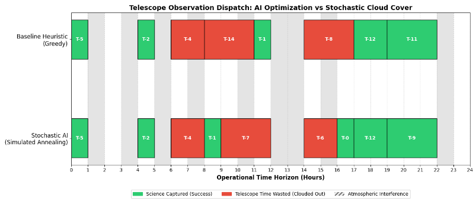

# Stochastic Observation Scheduling for Ground-Based Telescopes
[](https://www.python.org/downloads/)
[]()
[]()

> **An AI-driven Operations Research project modeling atmospheric stochasticity to optimize telescope observation schedules.**

## 🔭 Astrophysical Motivation
Modern ground-based observatories (such as the Vainu Bappu Observatory) face severe operational bottlenecks. Astronomers submit observation requests (targets) with varying scientific priorities, but the ground-truth condition—the atmospheric "seeing" and cloud cover—is highly unpredictable. 

Standard static dispatch heuristics often rely on greedy scheduling. However, in highly fragmented weather conditions, long-duration observations are frequently interrupted by sudden cloud cover, resulting in corrupted data and wasted telescope uptime. 

This project solves this by treating the atmosphere as a probabilistic variable. By utilizing a **Rolling Horizon Stochastic Optimizer** powered by **Simulated Annealing**, the telescope intelligently drops failure-prone targets in favor of viable observations based on simulated atmospheric futures.

---

## ⚙️ Core Features
* **Markov Chain Atmospheric Modeling:** Simulates realistic, fragmented cloud cover transitions rather than uniform random noise.
* **Rolling Horizon Optimization:** Evaluates the Expected Value ($\mathbb{E}[W]$) of observation schedules across thousands of probabilistic weather paths.
* **Simulated Annealing Metaheuristic:** Utilizes the Metropolis-Hastings acceptance criterion to escape local optima during schedule generation.
* **Automated Visualizations:** Generates comparative Dual Gantt charts mapping algorithmic decisions against ground-truth atmospheric interference.

---

## 🧮 Mathematical Formulation

The scheduling conflict is framed as a discrete-time Mixed-Integer optimization problem under stochastic constraints.

Let $x_{i,t} \in \{0, 1\}$ be the decision variable where $x_{i,t} = 1$ if observation $i$ starts at time $t$. 
Let $w_i$ be the scientific priority weight of target $i$.
Let $C_t \in \{0, 1\}$ be the stochastic weather state at time $t$, where $1$ is Clear and $0$ is Cloudy.

The objective is to maximize the **Expected Value** ($\mathbb{E}[W]$) of the total scientific weight captured:

$$
\max \mathbb{E}[W] = \sum_{i \in N} \sum_{t \in T} w_i \cdot x_{i,t} \cdot C_t
$$

**Subject to Constraints:**

1. **Temporal Non-Overlap:** $$
\sum_{i} \sum_{t'=t-d_i+1}^{t} x_{i,t'} \le 1
$$

*(The telescope can only observe one target at a time).*

2. **Visibility Windows:** $x_{i,t} = 0$ if $t$ is outside the object's specific rise/set window.

The atmospheric interference is modeled via a discrete-time transition matrix $P$:

$$
P = \begin{bmatrix} P(C_{t+1}=1|C_t=1) & P(C_{t+1}=0|C_t=1) \\ P(C_{t+1}=1|C_t=0) & P(C_{t+1}=0|C_t=0) \end{bmatrix}
$$

During optimization, the environment generates hundreds of probabilistic "weather futures" in $\mathcal{O}(T)$ time complexity to stress-test potential schedules.

---

## 🔬 Optimization Engine: Simulated Annealing

A standard greedy algorithm selects the highest $w_i$ currently visible, ignoring opportunity costs and weather trajectories. This project implements a Stochastic Simulated Annealing approach to find highly robust observation sequences.

The algorithm explores the search space by swapping target priorities. To escape local optima, it evaluates the change in Expected Value ($\Delta \mathbb{E}[W]$) between the current schedule and a neighbor schedule. Worse schedules are stochastically accepted based on the Metropolis-Hastings criterion:

$$
P(\text{accept}) = \exp\left(\frac{\Delta \mathbb{E}[W]}{T_{temp}}\right)
$$

As the computational temperature ($T_{temp}$) cools, the algorithm transitions from exploring risky schedules to exploiting the most robust sequence.

---

## ⏱️ Algorithm Complexity Analysis

Understanding the computational limits of the scheduler is critical for real-time observatory operations.

* **Greedy Baseline Heuristic:** $\mathcal{O}(N \log N + N \cdot T)$
  * Sorts targets by weight ($N \log N$), then iterates through the time horizon $T$ to find valid windows. Fast, but lacks look-ahead foresight.
* **Stochastic Simulated Annealing:** $\mathcal{O}(I \cdot S \cdot N)$
  * Where $I$ is the number of temperature iterations, $S$ is the number of Markov weather simulations per evaluation, and $N$ is the queue size. By optimizing matrix operations in Python, this approach remains highly feasible for real-time recalculation when actual weather deviates from forecasts.

---

## 📊 Results & Visualization

Tested over a 24-hour simulated horizon with heavy stochastic cloud fragmentation.

* **Greedy Baseline Yield:** 407
* **Stochastic AI Yield:** 446
* **Performance Delta:** **+9.6%**

 

---

## 🚀 Installation & Execution

### 1. Repository Structure
```text
├── final.py                # Master script containing the Environment, SA Engine, and Visualizer
├── Gantt.png               # Generated visual outputes
└── README.md               # Project documentation
